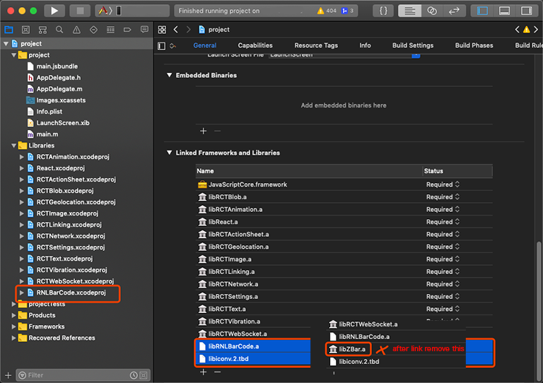
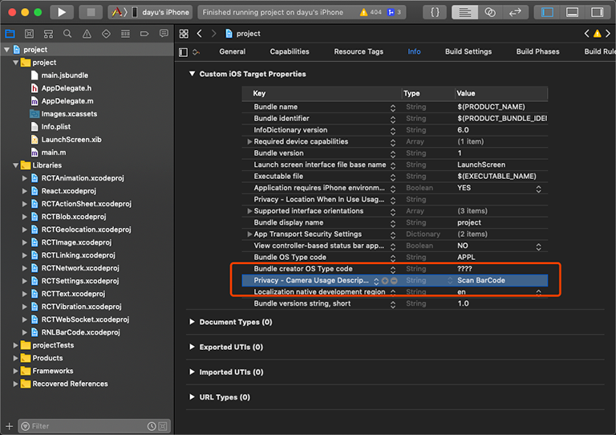
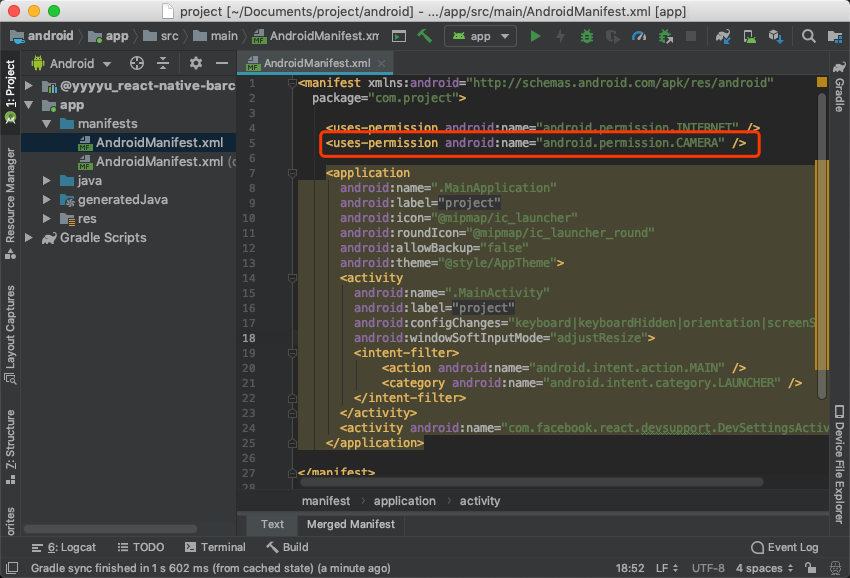

# react-native-barcode

[](https://www.npmjs.com/package/@yyyyu/react-native-barcode) [](https://travis-ci.org/yyyyu/react-native-barcode)

**Environment**
Xcode 10.2.1
react-native 0.59.5

## Getting Started

```bash
yarn add @yyyyu/react-native-barcode
# or
npm i @yyyyu/react-native-barcode --save
```

```bash
react-native link @yyyyu/react-native-barcode
```

## Example

- [image decode](example/Decoder.js)
- [scanner](example/Scanner.js)

### iOS

#### 1. add dependence

```txt
// Copy this
libiconv2.tbd
```

**remove libZBar.a**



#### 2. add camera permission

```txt
// Copy this
NSCameraUsageDescription
```



### Android

```xml
<!-- add camera permission -->
<uses-permission android:name="android.permission.CAMERA" />
```



## JS API

```typescript

// BarCode Wiki
// 12   UPC_A           https://en.wikipedia.org/wiki/Universal_Product_Code
// 9    UPC_E           https://en.wikipedia.org/wiki/Universal_Product_Code#UPC-E
// 13   EAN_13          https://en.wikipedia.org/wiki/International_Article_Number
// 5    EAN_5           https://en.wikipedia.org/wiki/EAN-5
// 8    EAN_8           https://en.wikipedia.org/wiki/EAN-8
// 2    EAN_2           https://en.wikipedia.org/wiki/EAN-2
// 15   UPC_EAN
// 38   CODA_BAR        https://en.wikipedia.org/wiki/Codabar
// 39   CODE_39         https://en.wikipedia.org/wiki/Code_39
// 51   CODE_39_C
// 289  CODE_39_FA      https://en.wikipedia.org/wiki/Code_39#Full_ASCII_Code_39
// 4051 CODE_39_FA_C
// 106  CODE_39_MOD_43  https://en.wikipedia.org/wiki/Code_39#Code_39_mod_43
// 93   CODE_93         https://en.wikipedia.org/wiki/Code_93
// 931  CODE_93I        https://barcodeguide.seagullscientific.com/Content/Symbologies/Code_93i.htm
// 128  CODE_128        https://en.wikipedia.org/wiki/Code_128
// 25   ITF             https://en.wikipedia.org/wiki/Interleaved_2_of_5
// 37   ITF_C
// 45   ITF_14          https://en.wikipedia.org/wiki/ITF-14
// 34   DATA_BAR        https://en.wikipedia.org/wiki/GS1_DataBar
// 35   DATA_BAR_EXP
// --   ISBN      `     https://en.wikipedia.org/wiki/International_Standard_Book_Number
// 10   ISBN_10
// 14   ISBN_13
// 57   PDF417          https://en.wikipedia.org/wiki/PDF417
// 225  AZTEC           https://en.wikipedia.org/wiki/Aztec_Code
// 200  DATA_MATRIX     https://en.wikipedia.org/wiki/Data_Matrix
// 94   MAXI_CODE       https://en.wikipedia.org/wiki/MaxiCode
// 64   QR_CODE         https://en.wikipedia.org/wiki/QR_code

import * as RNLBarCode from "@yyyyu/react-native-barcode";

// RNLBarCode.Type.[Common|ZXing|ZBar|Vision|AVFoundation].[BarCodeType]
RNLBarCode.Type.Common.QR_CODE

export declare enum Errors {
    InvokeFailed = -1,
    NoCameraPermission = -2,
    NoCameraDevice = -3
}

export enum Decoder {
    Auto = 0,
    ZXing = 1,
    ZBar = 2,
    Vision = 3,
    AVFoundation = 4,
}

interface IDecodeOption {
    data: string | number;
    screenshot?: boolean;
    formats?: number | number[];
    decoder?: Decoder;
}

export interface IDecodeResult {
    format: number;
    content: string;
}

RNLBarCode.decode({
  data: IMAGES.QR_CODE,
  formats: RNLBarCode.Type.Common.QR_CODE,
  decoder: RNLBarCode.Decoder.Auto
})

const Scanner = RNLBarCode.Scanner;

export enum TorchMode {
    Off = 0,
    On = 1,
    Auto = 2,
}

interface IScannerProps extends ViewProps {
    enable?: boolean;
    decoder?: Decoder;
    formats?: number | number[];
    torch?: TorchMode;
    onResult: (result: IDecodeResult | null, error: BarCodeError | null) => void;
}

<Scanner
  enable={true}
  decoder={RNLBarCode.Decoder.Auto}
  formats={RNLBarCode.Type.Common.QR_CODE}
  torch={RNLBarCode.TorchMode.Off}
  onResult={this.handleResult}
/>

```

## Feature

- iOS
  - Image: [Vision](https://developer.apple.com/documentation/vision) [ZBar](http://zbar.sourceforge.net/)
  - Scanner: [AVFundation](https://developer.apple.com/av-foundation/)
- Android
  - Image: [ZBar](http://zbar.sourceforge.net/) [ZXing](https://github.com/zxing/zxing)
  - Scanner: [ZBar](http://zbar.sourceforge.net/) [ZXing](https://github.com/zxing/zxing) + [CameraView](https://github.com/natario1/CameraView)
