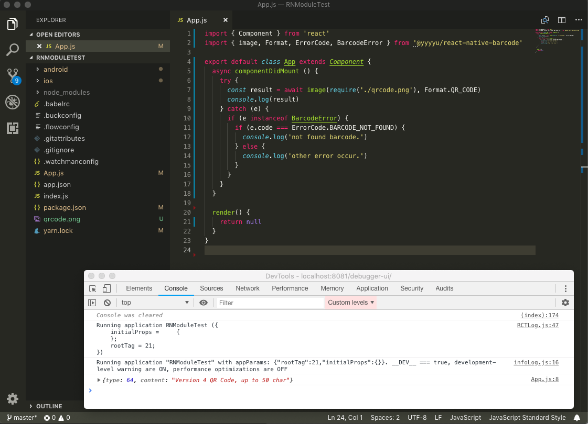
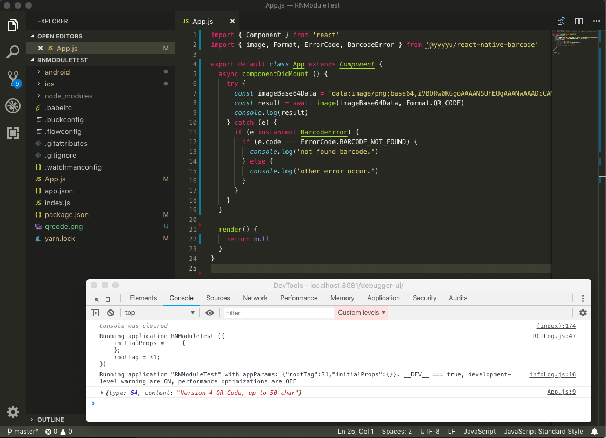
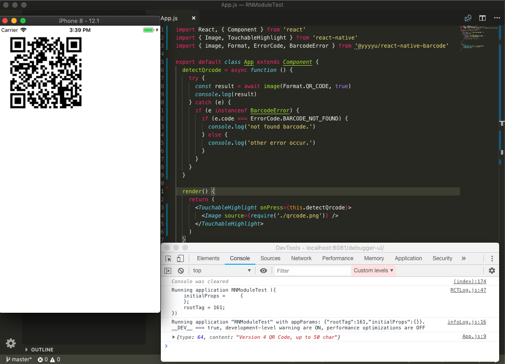
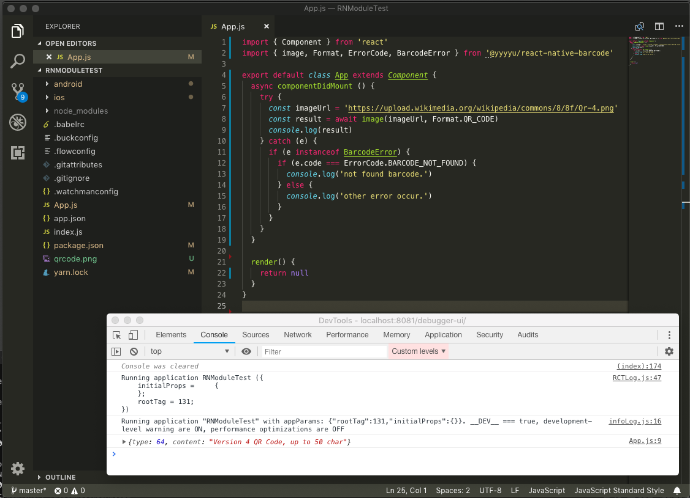
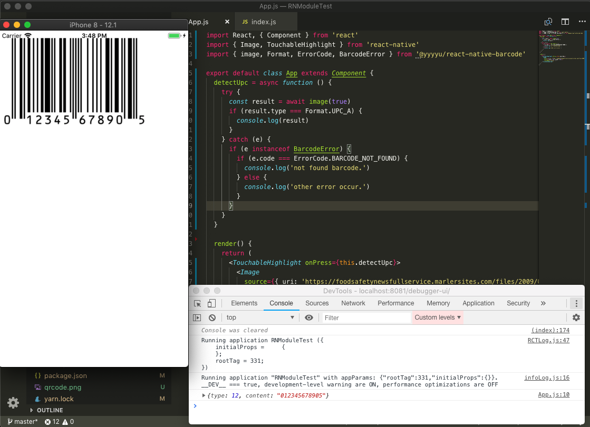
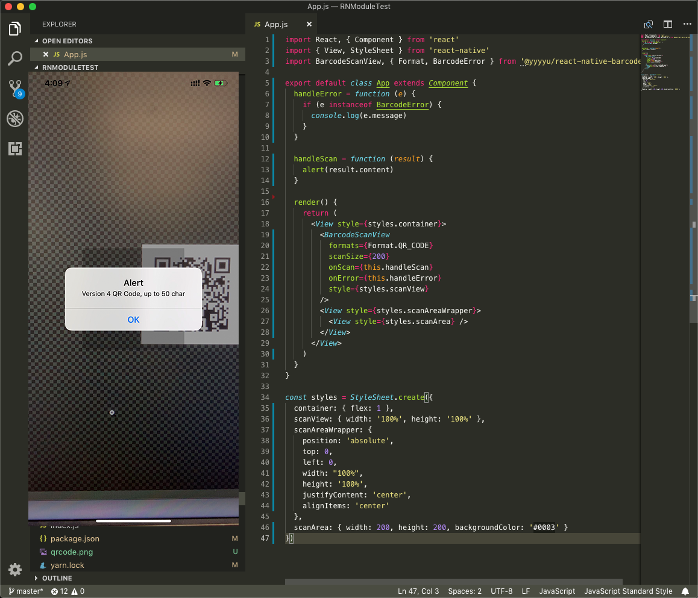
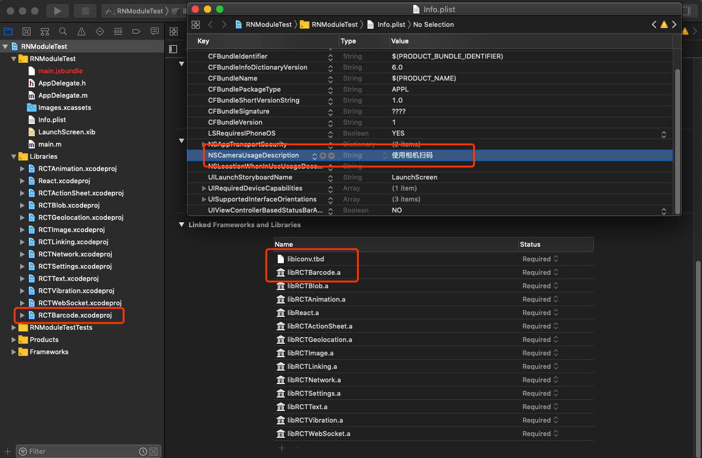
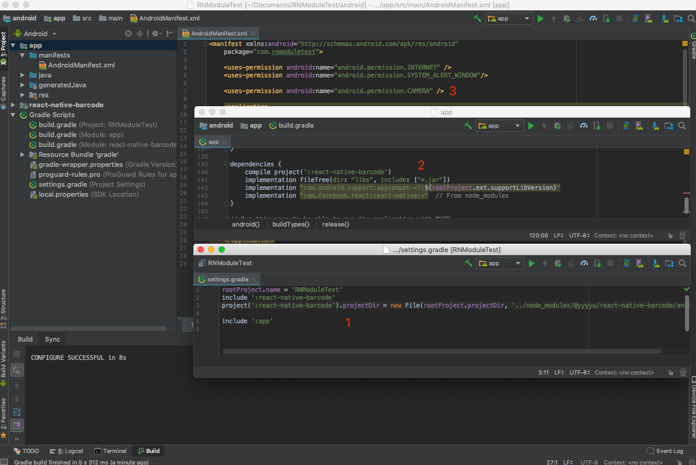

# react-native-barcode

## 特性

- 准确高效识别二维码、条形码、商品码等
- 同时使用 [ZBar](http://zbar.sourceforge.net/)、[ZXing](https://github.com/zxing/zxing)、[AVFundation](https://developer.apple.com/av-foundation/)
- 图像识别: iOS(ZBar)、Android(ZBar + ZXing)
- 扫码识别: iOS(AVFundation)、Android(ZBar)

科普:
ZBar 由 C 写成，识别效率高；
ZXing 由 Java 写成，能够识别难以识别的图片，速度稍慢；
AVFundation 是 iOS 开发框架的一部分，扫码识别质量和速度都很好。

## 此依赖解决的问题

- 丰富可定制的格式支持(支持近 20 种条形码规范，支持自定义组合)
- 图像识别(require、base64、file path、file uri、http uri 等数据形式提供统一的 api)、屏幕识别
- 扫码识别(比较知名的 [react-native-camera](https://github.com/react-native-community/react-native-camera) 不支持定义识别区域，功能比较多并不专注于扫码)
- 扫码组件样式可定义(设置尺寸、颜色、形状，任由你控制)
- 准确的错误定位(检测设备是否可用、权限)
- 健壮、性能(资源释放，图像压缩、设备不可用时减少不必要的计算，设置扫码区域提高识别率)

## Example

### Local Require


### Base64


### Screen


### Url


### UPC


### Scan


## 安装

```bash
yarn add @yyyyu/react-native-barcode
```

or

```bash
npm install --save @yyyyu/react-native-barcode
```

### iOS

```bash
react-native link @yyyyu/react-native-barcode
```

- CocoaPods
  - **使用** CocoaPods，在 Podfile 添加
    ```ruby
    pod 'React', :path => '../node_modules/react-native', :subspecs => ['Dependency']
    pod 'yoga', :path => '../node_modules/react-native/ReactCommon/yoga'
    ```
  - **不使用** CocoaPods，在 Linked Frameworks and Libraries 添加 libiconv.tbd
- 在 Info.plist 中添加相机权限 NSCameraUsageDescription



### Android

```bash
# 已经运行过不需要重复执行
react-native link @yyyyu/react-native-barcode
```

在 AndroidManifest.xml 文件中添加相机权限
```xml
<uses-permission android:name="android.permission.CAMERA" />
```



## JS API

```javascript
import BarcodeScanView, { image, Format, ErrorCode, BarcodeError } from '@yyyyu/react-native-barcode'

const imageLocal = require('xxx/xxx/barcode.png')
const imageBase64 = 'xxxxxxxxxxxx'
const imageBase64WithMime = 'data:image/png;base64,xxxxxxxx'
const imageFileUri = 'file:///xxx/barcode.png'
const imageFilePath = '/xxx/barcode.png'
const imageLink = 'https://cdn.image.com/barcode.png'

(async function() {
  try {
    const { type, content } = await image(imageXxx, Format.QR_CODE)
    console.log(`Result{ type: ${type}, content: ${content} }`)
  } catch (e) {
    if (e instanceof BarcodeError) {
      if (e.code === ErrorCode.BARCODE_NOT_FOUND) {
        console.log('not found barcode.')
      } else {
        console.log('other error occur.')
      }
    }
  }
})()

class ScanView extends Component {
  handleError = function (e) {
    if (e instanceof BarcodeError) {
      console.log(e.message)
    }
  }

  handleScan = function (result) {
    console.log(result)
  }

  render () {
    return (
      <View style={styles.container}>
        <BarcodeScanView
          formats={Format.QR_CODE}
          scanSize={200}
          onScan={this.handleScan}
          onError={this.handleError}
          style={styles.scanView}
        />
        <View style={styles.scanAreaWrapper}>
          <View style={styles.scanArea} />
        </View>
      </View>
    )
  }
}

const styles = StyleSheet.create({
  container: { flex: 1 },
  scanView: { width: '100%', height: '100%' },
  scanAreaWrapper: {
    position: 'absolute', 
    top: 0, 
    left: 0, 
    width: "100%", 
    height: '100%',
    justifyContent: 'center', 
    alignItems: 'center'
  },
  scanArea: { width: 200, height: 200, backgroundColor: '#0003' }
})
```

### image

```javascript
// 检测屏幕条形码
image()
image(true) 
image(Format | Format[], true)
// 检测图片条形码
image(string | number) 
image(string | number, Format | Format[]) 
```

### BarcodeScanView

```javascript
<BarcodeScanView
  enable={boolean} // 默认可用
  formats={Format | Format[]} // 默认全部
  flash={boolean} // 闪光灯 默认 false
  autoFocus={boolean} // 自动对焦 默认 true
  scanSize={number, { width: number, height: number }} // 识别区域 默认与显示区域相同
  onScan={function ({ type, content }) {}}
  onError={function (e) {}}
/>
```

### FORMAT
```javascript
const Format = {
  // common
  CODE_39: 39, // Code 39 1D format.
  CODE_93: 93, // Code 93 1D format.
  CODE_128: 128, // Code 128 1D format.
  EAN_8: 8, // EAN-8
  EAN_13: 13, // EAN-13.
  PDF_417: 57, // PDF417 format.
  QR_CODE: 64, // QR Code 2D barcode format.
  UPC_E: 9, // UPC-E 1D format.
  // zbar special
  CODABAR: 38, // CODABAR 1D format.
  COMPOSITE: 15, // EAN/UPC composite iosOnly
  DATABAR: 34, // DataBar (RSS-14).
  DATABAR_EXP: 35, // DataBar Expanded.
  EAN_2: 2, // GS1 2-digit add-on iosOnly
  EAN_5: 5, // GS1 5-digit add-on iosOnly
  I_25: 25, // Interleaved 2 of 5.
  ISBN_10: 10, // ISBN-10 (from EAN-13)
  ISBN_13: 14, // ISBN-13 (from EAN-13).
  UPC_A: 12, // UPC-A 1D format.
  // zxing special
  AZTEC: 70, // Aztec 2D barcode format.
  CODABAR: 38, // CODABAR 1D format.
  DATA_MATRIX: 71, // Data Matrix 2D barcode format.
  ITF: 72, // ITF (Interleaved Two of Five) 1D format.
  MAXICODE: 73, // MaxiCode 2D barcode format.
  RSS_14: 74, // RSS 14
  RSS_EXPANDED: 75, // RSS EXPANDED
  UPC_A: 12, // UPC-A 1D format.
  UPC_EAN_EXTENSION: 76, // UPC/EAN extension format. Not a stand-alone format.
  // av fundation special
  AZTEC: 70, // Aztec codes
  CODE_39_MOD43: 77, // Code 39 mod 43
  DATA_MATRIX: 71, // DataMatrix
  ITF: 72, // Interleaved 2 of 5 codes
  ITF14: 78 // ITF14 codes
}
```

### ERROR CODE

```javascript
const ErrorCode = {
  BARCODE_NOT_FOUND: -1, // 未识别出条形码
  DECODE_FAILED: -2, // 解码失败(图片转换过程出错)
  FILE_NOT_FOUND: -3, // 文件未发现(传入图片路径未找到文件)
  NOT_GRANT_READ_IMAGE: -4, // 未授权读取图片
  NOT_GRANT_USE_CAMERA: -5, // 未授权使用相机
  DEVICE_NO_CAMERA: -6, // 设备没有摄像头
  OPEN_CAMERA_FAILED: -7, // 打开摄像头失败(快速前后台切换会出现，现象是预览效果卡住，应该是一个可以解决的bug，暂时还没改，不会导致闪退) androidOnly
  ILLEGAL_PARAMETER: -9 // 非法参数
}
```

## 已知问题

1. 安卓多次前后台切换会导致预览页面卡住，同时报错 OPEN_CAMERA_FAILED，原因是设置预览失败

## 源码参考

1. Android CameraView 来自于 [react-native-camera](https://github.com/react-native-community/react-native-camera) -> [google cameraview](https://github.com/google/cameraview)
2. Android ZBar .so 文件来自于 [dm77/barcodescanner](https://github.com/dm77/barcodescanner) 解决 Android6.0 使用[问题](https://github.com/dm77/barcodescanner/issues/123)